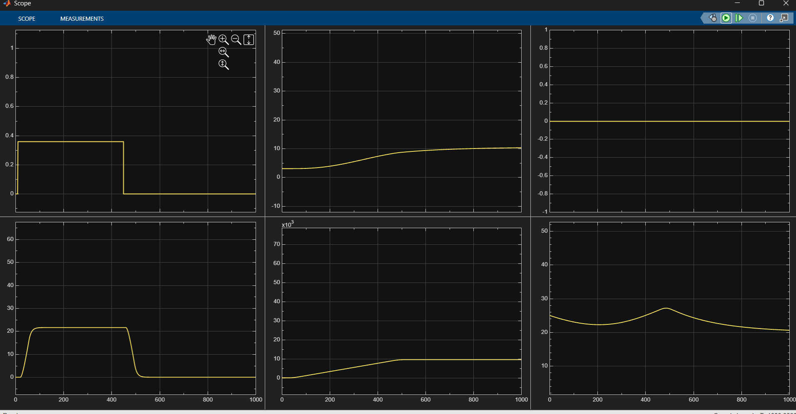
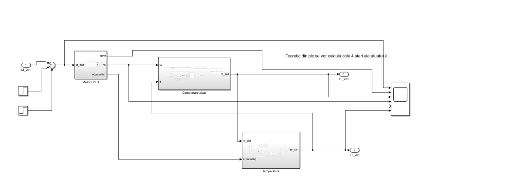

# Digital Twin: High-Fidelity Industrial Bakery Line Simulation
### Proiect Digital Twin: Simulare Linie Industrială de Panificație (Înaltă Fidelitate)

---

## 🌎 README 

### 📌 Project Overview
This project focuses on the development of a Digital Twin for a continuous industrial bakery production line, specifically targeting the Proofer and the 3-Phase Tunnel Oven.

The main objective is to bridge the gap between theoretical thermodynamics and industrial control by creating a high-fidelity virtual plant that replicates real-world behaviors. This includes modeling non-linear mass transfer, heat exchange, and complex process disturbances.

The simulation utilizes a standard Industrial Automation stack, including:
* **MATLAB & Simulink:** For physical process modeling and control loop design.
* **Siemens TIA Portal (v19):** For PLC emulation and control logic implementation.
  
  

> **Note:** This is a private academic project. The source code is currently restricted to maintain academic integrity and intellectual property during the development phase.

---

### 🏗️ System Architecture
The simulation is built on a three-tier hierarchical architecture:

1. **Physical Plant (Simulink):** Non-linear differential equations governing the proofer and oven dynamics (temperature, humidity, mass transfer).
2. **Control Layer (PLC Emulation):** Sequential logic (GRAFCET/SFC) and multi-variable PID controllers (emulating Siemens S7-1200/1500 logic).
3. **Supervisory Level (HMI/SCADA):** Data visualization and recipe management.

---

### ✅ Current Progress (Milestones Reached)

* [x] **P&ID Design:** Complete instrumentation and piping diagram for the Proofer and 3-Zone Oven.
* [x] **Thermodynamic Core:** Implementation of the Antoine Equation for saturation pressure and phase-change mass transfer.
* [x] **Proofer Simulation:** High-fidelity modeling of $T/RH$ (Temperature/Relative Humidity) coupling.

*Figure 1: Scope output showing successful coupling of Temperature and Relative Humidity during a simulated proofing cycle.*

* [x] **3-Phase Oven Logic:** Spatial-to-temporal transformation using Variable Transport Delay to simulate the conveyor belt flow.
* [x] **Disturbance Modeling:** Successful simulation of "Open Door" scenarios and their impact on system enthalpy and mass balance.

---

### 🚀 Roadmap (Future Milestones)

* [ ] **Advanced Control Tuning:** Implementing Anti-Windup mechanisms and multi-variable decoupling for $T/RH$ loops.
* [ ] **Stateflow Integration:** Developing the full GRAFCET/SFC state machine for "Cold Start" and "Emergency Stop" routines using Stateflow (see preliminary logic below).

* [ ] **HMI Dashboard:** Creating a dedicated Simulink Dashboard to emulate a WinCC/TIA Portal HMI interface.
* [ ] **Validation & Stress Testing:** Comparing PID performance vs. On-Off control under variable production loads (Bread vs. Croissants).

---

### 🛠️ Technical Keywords
Model-Based Design (MBD) • Non-linear Systems • PID Control • Mass & Heat Transfer • Industry 4.0 • Software-in-the-Loop (SIL) • TIA Portal • Simulink • Stateflow

---

## 🇷🇴 README în Română

### 📌 Rezumatul Proiectului
Acest proiect vizează dezvoltarea unui Digital Twin pentru o linie continuă de producție industrială de panificație, concentrându-se în special pe dospitor (Proofer) și pe cuptorul tunel trifazat.

Obiectivul principal este crearea unei punți între termodinamica teoretică și controlul industrial, prin realizarea unei instalații virtuale de înaltă fidelitate care replică comportamentele reale. Aceasta include modelarea transferului de masă neliniar, a schimbului de căldură și a perturbațiilor complexe ale procesului.

Simularea utilizează un stack standard de Automatizare Industrială, incluzând:
* **MATLAB & Simulink:** Pentru modelarea proceselor fizice și proiectarea buclelor de control.
* **Siemens TIA Portal (v19):** Pentru emularea PLC-ului și implementarea logicii de control.

> **Notă:** Acesta este un proiect academic privat. Codul sursă este momentan restricționat pentru a menține integritatea academică și proprietatea intelectuală în timpul fazei de dezvoltare.

---

### 🏗️ Arhitectura Sistemului
Simularea este construită pe o arhitectură ierarhică pe trei niveluri:

1. **Instalația Fizică (Simulink):** Ecuații diferențiale neliniare care guvernează dinamica dospitorului și a cuptorului (temperatură, umiditate, transfer de masă).
2. **Nivelul de Control (Emulare PLC):** Logică secvențială (GRAFCET/SFC) și controllere PID multivariabile (emulând logica Siemens S7-1200/1500).
3. **Nivelul de Supervizare (HMI/SCADA):** Vizualizarea datelor și managementul rețetelor.

---

### ✅ Progres Actual (Etape Atinge)

* [x] **Proiectare P&ID:** Diagrama completă de instrumentație și conducte pentru dospitor și cuptorul cu 3 zone.
* [x] **Nucleul Termodinamic:** Implementarea Ecuației lui Antoine pentru presiunea de saturație și transferul de masă la schimbarea de fază.
* [x] **Simulare Dospitor:** Modelare de înaltă fidelitate a cuplajului $T/RH$ (Temperatură/Umiditate Relativă). (Vezi Figura 1 în secțiunea EN pentru rezultate).
* [x] **Logică Cuptor Tunel:** Transformare spațio-temporală folosind Variable Transport Delay pentru a simula fluxul benzii transportoare.
* [x] **Modelarea Perturbațiilor:** Simularea reușită a scenariilor de tip "Ușă Deschisă" și impactul acestora asupra entalpiei sistemului și a balanței de masă.

---

### 🚀 Roadmap (Etape Viitoare)

* [ ] **Acordarea Avansată a Controlului:** Implementarea mecanismelor Anti-Windup și decuplarea multivariabilă pentru buclele $T/RH$.
* [ ] **Integrare Stateflow:** Dezvoltarea automatei de stări GRAFCET/SFC complete pentru rutinele de "Pornire la Rece" și "Oprire de Urgență" folosind Stateflow. (Vezi Figura 2 în secțiunea EN pentru logica preliminară).
* [ ] **Dashboard HMI:** Crearea unui Simulink Dashboard dedicat pentru a emula o interfață HMI WinCC/TIA Portal.
* [ ] **Validare și Stress Testing:** Compararea performanței PID vs. control On-Off sub sarcini de producție variabile (Pâine vs. Croissante).

---

### 🛠️ Cuvinte Cheie Tehnice
Model-Based Design (MBD) • Sisteme Neliniari • Control PID • Transfer de Masă și Căldură • Industrie 4.0 • Software-in-the-Loop (SIL) • TIA Portal • Simulink • Stateflow

---

### 📧 Contact & Context Academic
This project is part of my academic research in Industrial Automation. For inquiries regarding the methodology or collaboration, feel free to reach out via GitHub.

**Victor-Samuel CÎMPEAN**
Student - Technical University of Cluj-Napoca (UTCN)