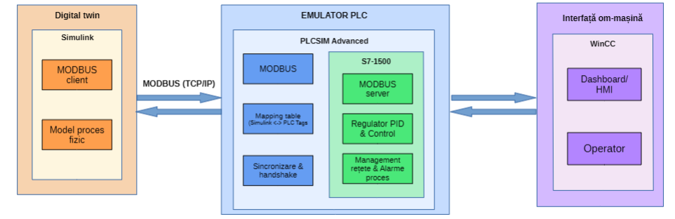
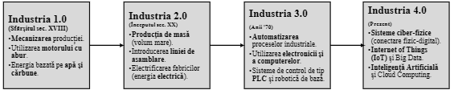
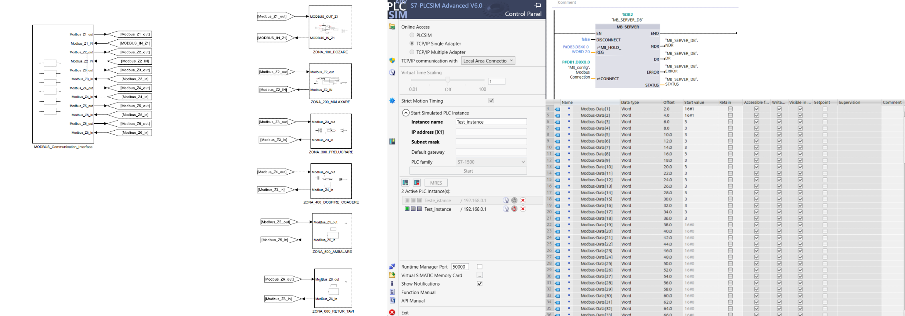
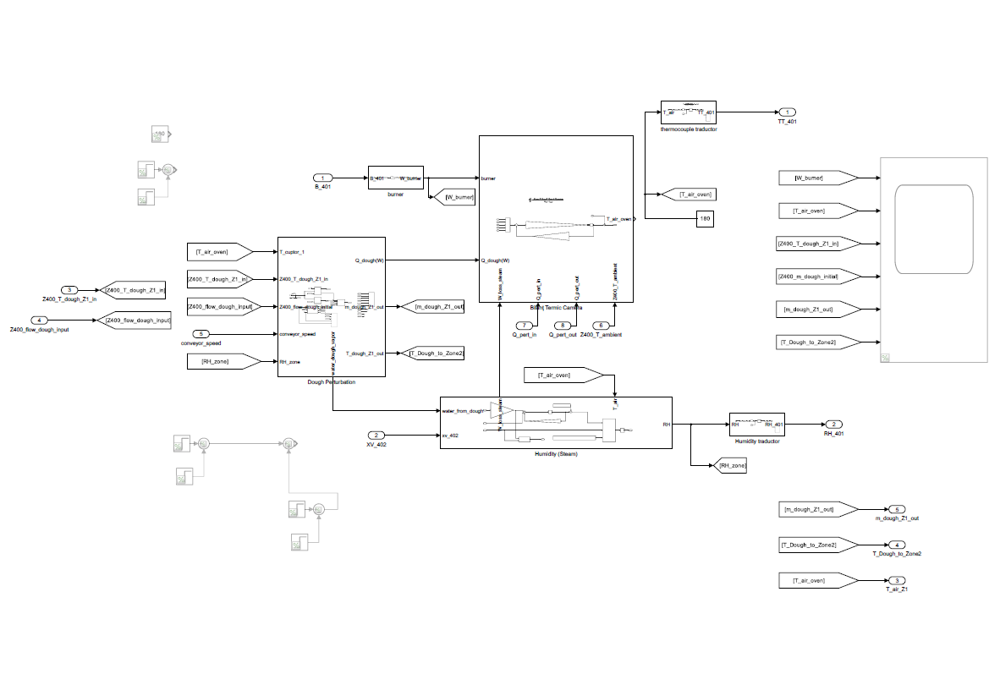

# Digital Twin: Control High-Fidelity Industrial Bakery Line Simulation
### Proiect Digital Twin: Simulare și Control Linie Industrială de Panificație 

---

## 🌎 README

### 📌 Project Overview
This project focuses on the development and control of a Digital Twin for a continuous industrial bakery production line, specifically targeting the Proofer and the 3-Phase Tunnel Oven.

The main objective is to bridge the gap between theoretical thermodynamics and industrial control by creating a high-fidelity virtual plant that replicates real-world behaviors. This includes modeling non-linear mass transfer, heat exchange, and complex process disturbances.

The simulation utilizes a standard Industrial Automation stack, including:
* **MATLAB & Simulink:** For physical process modeling and control loop design.
* **Siemens TIA Portal (v19):** For PLC emulation and control logic implementation.

  
  

> **Note:** This is a private academic project. The source code is currently restricted to maintain academic integrity and intellectual property during the development phase.

---

### 🏗️ System Architecture
The simulation is built on a three-tier hierarchical architecture:

1. **Physical Plant (Simulink):** Non-linear differential equations governing the proofer and oven dynamics (temperature, humidity, mass transfer).
2. **Control Layer (PLC Emulation):** Sequential logic (GRAFCET/SFC) and multi-variable PID controllers (emulating a Siemens S7-1500 CPU).
3. **Supervisory Level (HMI/SCADA):** Data visualization and recipe management.

---

### ✅ Current Progress (Milestones Reached)

#### 📐 Process Flow & Instrumentation (P&ID)
The system architecture follows the **ISA-5.1 standard** for P&ID, mapping every physical sensor (Temperature, Level, Flow, Humidity) to its corresponding logic in the Control Layer.

*Figure 5: P&ID of the industrial line, detailing the 3-zone Oven and Proofer sensor loops.*

#### 🔌 Industrial Communication (Modbus TCP/IP)
The project implements a robust **Modbus TCP/IP** communication layer. It maps the 6 production zones into **16-bit Holding Registers** for bidirectional real-time data exchange between the Simulink physical plant (Server) and the emulated Siemens PLC (Client) in a **Software-in-the-Loop (SIL)** configuration.

*Figure 6: Modbus interface mapping data registers for all 6 production zones (Dosing, Mixing, Processing, Proofing/Baking, Packaging, and Tray Return).*

#### 🔥 Thermodynamic Core: Oven Dynamics
The oven's thermal core goes beyond simple blocks; it involves the implementation of energy balance equations using convective heat transfer coefficients calculated for the tunnel air velocity, coupled with the latent heat of evaporation from the dough.

*Figure 7: Simulink implementation of the Thermal Balance Chamber, including the burner model, dough enthalpy absorption, and steam/humidity dynamics.*

* [x] **Proofer Simulation:** High-fidelity modeling of $T/RH$ (Temperature/Relative Humidity) coupling.
* [x] **3-Phase Oven Logic:** Spatial-to-temporal transformation using Variable Transport Delay to simulate the conveyor belt flow.
* [x] **Disturbance Modeling:** Successful simulation of "Open Door" scenarios and their impact on system enthalpy and mass balance.

---

### ⚠️ Technical Challenges
* **Sampling Time Sync:** Synchronizing the Simulink solver step size with the Modbus polling rate from TIA Portal to avoid jitter in the $T/RH$ control loops.
* **Non-linearity:** Tuning the saturation pressure blocks to remain stable during rapid temperature transients.

---

### 🚀 Roadmap (Future Milestones)

* [ ] **Advanced Control Strategies:** Moving from standard PID to Feed-forward control to compensate for conveyor speed changes.
* [ ] **Safety & Stateflow Integration:** Developing the full GRAFCET/SFC state machine for "Cold Start", "Emergency Stop", and safety interlocks (e.g., preventing burner ignition if the conveyor stops).
* [ ] **HMI Dashboard:** Creating a dedicated Simulink Dashboard to emulate a WinCC/TIA Portal HMI interface.
* [ ] **Validation & Stress Testing:** Evaluating control performance under variable production loads (Bread vs. Croissants).

---

### 🛠️ Technical Keywords
Model-Based Design (MBD) • Non-linear Systems • PID Control • Mass & Heat Transfer • Industry 4.0 • Software-in-the-Loop (SIL) • TIA Portal • Simulink • Stateflow

---

## 🇷🇴 README în Română

### 📌 Rezumatul Proiectului
Acest proiect vizează dezvoltarea și controlul unui Digital Twin pentru o linie continuă de producție industrială de panificație, concentrându-se în special pe dospitor (Proofer) și pe cuptorul tunel trifazat.

Obiectivul principal este crearea unei punți între termodinamica teoretică și controlul industrial, prin realizarea unei instalații virtuale de înaltă fidelitate care replică comportamentele reale. Aceasta include modelarea transferului de masă neliniar, a schimbului de căldură și a perturbațiilor complexe ale procesului.

Simularea utilizează un stack standard de Automatizare Industrială, incluzând:
* **MATLAB & Simulink:** Pentru modelarea proceselor fizice și proiectarea buclelor de control.
* **Siemens TIA Portal (v19):** Pentru emularea PLC-ului și implementarea logicii de control.

> **Notă:** Acesta este un proiect academic privat. Codul sursă este momentan restricționat pentru a menține integritatea academică și proprietatea intelectuală în timpul fazei de dezvoltare.

---

### 🏗️ Arhitectura Sistemului
Simularea este construită pe o arhitectură ierarhică pe trei niveluri:

1. **Instalația Fizică (Simulink):** Ecuații diferențiale neliniare care guvernează dinamica dospitorului și a cuptorului (temperatură, umiditate, transfer de masă).
2. **Nivelul de Control (Emulare PLC):** Logică secvențială (GRAFCET/SFC) și controllere PID multivariabile (emulând logica unui CPU Siemens S7-1500).
3. **Nivelul de Supervizare (HMI/SCADA):** Vizualizarea datelor și managementul rețetelor.

---

### ✅ Progres Actual 

#### 📐 Schema de Flux și Instrumentație (P&ID)
Arhitectura sistemului respectă **standardul ISA-5.1** pentru P&ID, mapând fiecare senzor fizic (Temperatură, Nivel, Debit, Umiditate) la logica corespunzătoare din nivelul de control.

*Figura 5: P&ID-ul complet al liniei industriale.*

#### 🔌 Comunicare Industrială (Modbus TCP/IP)
Proiectul implementează un strat de comunicare **Modbus TCP/IP** robust. Acesta mapează cele 6 zone de producție în **Holding Registers de 16 biți** pentru schimbul bidirecțional de date în timp real între instalația fizică din Simulink (Server) și logica de control din PLC-ul Siemens (Client), într-o configurație **Software-in-the-Loop (SIL)**.

*Figura 6: Interfața Modbus care mapează registrele de date pentru toate cele 6 zone de producție.*

#### 🔥 Nucleul Termodinamic: Dinamica Cuptorului
Nucleul termic al cuptorului implică implementarea ecuațiilor de bilanț energetic folosind coeficienți de transfer termic convectiv calculați pentru viteza aerului din tunel, cuplați cu căldura latentă de evaporare a aluatului.

*Figura 7: Implementarea Simulink a Bilanțului Termic al Camerei.*

* [x] **Simulare Dospitor:** Modelare de înaltă fidelitate a cuplajului $T/RH$ (Temperatură/Umiditate Relativă).
* [x] **Logică Cuptor Tunel:** Transformare spațio-temporală folosind Variable Transport Delay pentru a simula fluxul benzii transportoare.
* [x] **Modelarea Perturbațiilor:** Simularea reușită a scenariilor de tip "Ușă Deschisă" și impactul acestora asupra balanței de masă.

---

### ⚠️ Provocări Tehnice
* **Sincronizarea Timpului de Eșantionare:** Corelarea pasului de integrare din Simulink cu rata de interogare Modbus din TIA Portal pentru a evita instabilitatea ("jitter") în buclele de control $T/RH$.
* **Neliniare:** Acordarea blocurilor de presiune de saturație pentru a rămâne stabile în timpul schimbărilor bruște de temperatură.

---

### 🚀 Roadmap (Etape Viitoare)

* [ ] **Strategii Avansate de Control:** Trecerea de la PID standard la control de tip Feed-forward pentru a compensa variațiile de viteză ale benzii.
* [ ] **Integrare Stateflow și Siguranță:** Dezvoltarea automatei de stări GRAFCET complete pentru rutinele de pornire, oprire și interlock-uri de siguranță (ex. oprirea arzătorului dacă banda se blochează).
* [ ] **Dashboard HMI:** Crearea unui Simulink Dashboard dedicat pentru a emula o interfață HMI WinCC/TIA Portal.
* [ ] **Validare și Stress Testing:** Evaluarea performanței controlului sub sarcini de producție variabile (Pâine vs. Croissante).

---

### 🛠️ Cuvinte Cheie Tehnice
Model-Based Design (MBD) • Sisteme Neliniari • Control PID • Transfer de Masă și Căldură • Industrie 4.0 • Software-in-the-Loop (SIL) • TIA Portal • Simulink • Stateflow

---

### 📧 Contact & Context Academic
This project is part of my academic research in Industrial Automation. For inquiries regarding the methodology or collaboration, feel free to reach out via GitHub.

**Victor-Samuel CÎMPEAN**
Student - Technical University of Cluj-Napoca (UTCN)